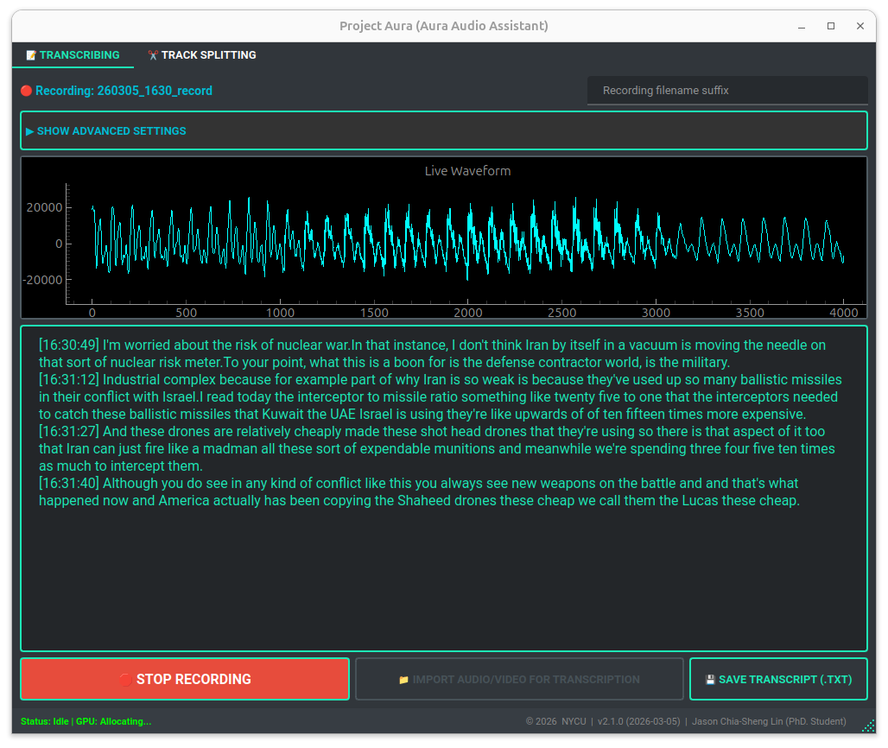
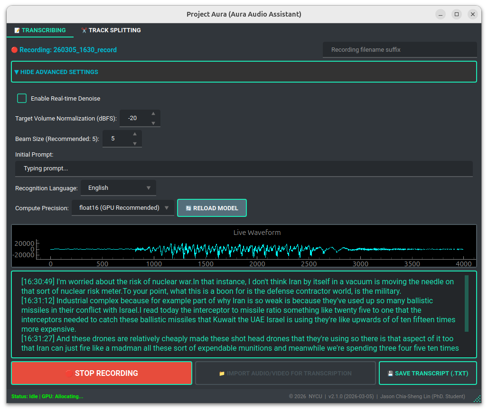

# Project AURA: Ultimate Audio Assistant Refactor

      

Project AURA is a desktop audio assistant for real-time recording, Whisper-based transcription, batch file transcription, and smart audio splitting.

This repository is the clean Python refactor of the working `audio_assistant_v1.5.0.py` script from `record_audio_ubuntu`. It intentionally does **not** copy the recording archive, `.record/` virtual environment, temporary transcripts, or generated media files.



## Project Status

The original `record_audio_ubuntu` folder mixed source code, runtime environment, and many generated recordings/transcripts. This sibling repository separates the maintainable application source from runtime data.

Use this repo for:

- source refactoring
- package structure
- tests and regression checks
- future Python releases

Keep historical recordings and generated transcripts in `record_audio_ubuntu` or another data folder.

The legacy one-file implementation is retained for audit and behavior comparison:

```text
docs/legacy_audio_assistant_v1.5.0.py
```

## Executive Summary

Project AURA integrates two core workflows:

1. **Real-time / file-based transcription** with timestamped logs.
2. **Smart audio splitting** that finds natural pause points to avoid cutting speech mid-sentence.

The app is designed for professional meeting and lecture workflows. It includes prompt-guided punctuation, optional background noise reduction, batch processing, and memory-management safeguards for heavier ASR workloads.

## Project Metadata

| Field | Value |
| --- | --- |
| Project Name | Project AURA / Ultimate Audio Assistant |
| Refactor Version | `1.5.0` |
| ASR Model | `SoybeanMilk/faster-whisper-Breeze-ASR-25` |
| GitHub Repository | `JasonLn0711/project_aura` |
| Academic Affiliation | National Yang Ming Chiao Tung University (NYCU) |
| Project Lead | Jason Chia-Sheng Lin (PhD. Student) |
| License | MIT |

## Feature Implementation Checklist

| Feature Category | Implementation Details |
| --- | --- |
| Real-time Transcription | Live microphone recording plus streaming ASR via `faster-whisper`. |
| Batch Transcription | Import multiple audio/video files with queue scheduling and progress tracking. |
| Real-time Denoising | Optional `noisereduce` processing before ASR for noisy environments. |
| Volume Normalization | Dynamically standardizes imported and recorded audio to a target dBFS, default `-20`. |
| Asynchronous Architecture | `ModelLoaderThread` prevents UI freezing during initialization and compute-type switching. |
| CUDA Fallback | CUDA runtime preload and CPU/int8 fallback when CUDA libraries are unavailable. |
| System Tray Integration | Minimizes to background with `QSystemTrayIcon`. |
| Auto-update Checker | Background GitHub release check preserved from the original app. |
| Smart Splitting | Uses silence detection to cut near natural pauses and preserves original bitrate when possible. |
| Modern Desktop UI | PyQt6 tabs, live waveform visualization, and foldable Advanced Settings. |



## What Changed In This Refactor

The original project used a monolithic script. This repo keeps the behavior but splits the code by responsibility:

```text
project_aura_refactor/
├── pyproject.toml
├── README.md
├── requirements.txt
├── docs/
│   ├── legacy_audio_assistant_v1.5.0.py
│   └── refactor_plan.md
├── img/
│   ├── image.png
│   └── image-1.png
├── src/aura/
│   ├── app.py                    # QApplication entrypoint
│   ├── config.py                 # Runtime constants
│   ├── metadata.py               # Version and project metadata
│   ├── asr/
│   │   ├── file_pipeline.py      # File prep, formatting, cancellation, and transcription services
│   │   └── threads.py            # Thin Qt wrappers for model loading, live ASR, batch file ASR
│   ├── audio/
│   │   ├── capture.py            # PyAudio/PulseAudio recording thread
│   │   ├── denoise.py            # Safe noisereduce wrapper
│   │   ├── export.py             # Recording normalization/export helpers
│   │   └── splitter.py           # Smart audio splitting thread
│   ├── system/
│   │   ├── cuda.py               # CUDA runtime preload and fallback detection
│   │   ├── native_audio.py       # ALSA/JACK stderr suppression helpers
│   │   └── update_checker.py     # Background GitHub release check
│   └── ui/
│       ├── main_window.py
│       ├── splitter_tab.py
│       └── transcription_tab.py
└── tests/
    ├── test_denoise.py
    └── test_prompt_defaults.py
```

## Fixed From The v1.5.0 Baseline

- Short live denoise buffers now use adaptive `n_fft`, `win_length`, and `hop_length`.
- Native JACK/PortAudio probe noise is suppressed during audio device initialization.
- The default prompt path is explicit and tested for both batch and live ASR.
- Runtime outputs are ignored without hiding source files.
- The app source is importable and testable as a package.
- File import transcription is extracted into a testable pipeline service outside the Qt thread.

## Environment Requirements

### Recommended Runtime

- OS: Ubuntu 22.04 / 24.04 desktop
- Python: 3.10+
- GPU: NVIDIA CUDA-capable GPU is optional but recommended for faster ASR
- Audio stack: PulseAudio or PipeWire with PulseAudio compatibility

### System Packages

```bash
sudo apt-get update
sudo apt-get install -y portaudio19-dev python3-dev ffmpeg
```

`portaudio19-dev` and `python3-dev` are needed for PyAudio. `ffmpeg` is required by `pydub` for media import/export.

## Install

Use a fresh virtual environment in this repo:

```bash
python3 -m venv .venv
source .venv/bin/activate
python -m pip install --upgrade pip
python -m pip install -e .
```

If you prefer the pinned legacy dependency list:

```bash
python -m pip install -r requirements.txt
```

## Run

From this sibling repo:

```bash
python -m aura
```

or, after editable install:

```bash
aura
```

The packaged entrypoints are defined in `pyproject.toml`:

- `aura`
- `project-aura`

## UI Workflow

### Tab 1: Recording & Transcription

1. Wait for the background `ModelLoaderThread` to initialize the ASR model.
2. Open **Advanced Settings** to adjust target dBFS, compute type, beam size, language, initial prompt, and denoise.
3. Click **Start Recording** for live recording and live transcription.
4. Click **Import Audio/Video** for batch transcription.
5. Click **Save Transcript** to write the transcript to disk.

### Tab 2: Smart Splitter

1. Select source audio or video.
2. Select output folder.
3. Set target segment length and tolerance.
4. Start splitting to export chunks near natural pauses.

## Configuration Defaults

| Setting | Default |
| --- | --- |
| Sample Rate | `16000` |
| Chunk Size | `30 ms` / `480 samples` |
| VAD Level | `3` |
| ASR Model | `SoybeanMilk/faster-whisper-Breeze-ASR-25` |
| Device | `cuda`, with CPU fallback |
| Compute Type | `float16`, with `int8` fallback |
| Target Volume | `-20 dBFS` |
| Denoise | Off in UI by default |

## Runtime Files

Temporary transcription files are written outside the source tree by default:

```text
/tmp/project_aura/
```

Set `AURA_RUNTIME_DIR` to override this location:

```bash
export AURA_RUNTIME_DIR=/path/to/runtime
```

The runtime directory stores transient normalized WAV files and the live transcript backup. It is not intended for permanent recordings or final transcript exports.

## Default Prompt Behavior

The default file-transcription prompt is:

```text
這是一份專業的繁體中文會議紀錄，請務必根據語氣加上正確的全形標點符號。
```

It is loaded into the Advanced Settings prompt field at startup and is passed to both batch file transcription and live recording when recording starts.

The lower-level ASR threads also have explicit defaults:

- File transcription uses the Traditional Mandarin meeting-record prompt when no prompt is supplied.
- Live transcription uses `The following is a professional meeting record.` when no live prompt is supplied.
- If a caller explicitly passes an empty string, the app respects that as "no prompt".

## Denoise Behavior

Live denoise is intentionally conservative:

- Silent and near-silent buffers are returned unchanged.
- Very tiny buffers are skipped because spectral reduction has too little context.
- Non-silent buffers use `noisereduce` in non-stationary mode with gentle reduction, `prop_decrease=0.35`.
- FFT and hop sizes are capped dynamically so short live buffers cannot trigger `noverlap must be less than nperseg`.

On the current workstation using the legacy `.record` environment, rough timings were:

| Buffer | Approx. audio length | Runtime |
| --- | ---: | ---: |
| 480 samples | 30 ms | ~11 ms |
| 8,000 samples | 0.5 s | ~12 ms |
| 16,000 samples | 1.0 s | ~13 ms |
| 128,000 samples | 8.0 s | ~33 ms |

A synthetic 2-second noisy tone check improved estimated SNR by about `+0.43 dB` without NaN/Inf output. This is a smoke test, not a substitute for listening tests on real meeting audio.

## Test

The regression tests use the Python standard library:

```bash
PYTHONPATH=src python -m unittest discover -s tests
```

Current coverage includes:

- file transcription pipeline formatting, prep, cleanup, and cancellation behavior
- recording WAV-to-MP3 normalization/export behavior
- short-buffer denoise stability
- silence denoise bypass
- synthetic signal preservation smoke check
- runtime temp path and backup cleanup behavior
- default prompt behavior for batch and live ASR
- transcribe keyword construction for language and prompt handling

GitHub Actions also runs compile and unit tests on pushes to `main`, `refactor/**`, and pull requests.

## Troubleshooting

### GPU Out Of Memory

- Open Advanced Settings and switch Compute Type to `int8`.
- Close other GPU-heavy applications.
- The app releases model references, runs garbage collection, and clears CUDA cache during cleanup when PyTorch is available.

### CUDA Runtime Missing

The refactor keeps CUDA runtime preload logic in `src/aura/system/cuda.py`. If required CUDA libraries are unavailable, model loading falls back to CPU/int8 and emits a UI status message.

### JACK / ALSA Probe Noise

Linux audio backends can emit JACK/ALSA diagnostics even when the app uses PulseAudio successfully. The refactor suppresses native stderr during device probing and stream opening.

### Mic Device Issues

AURA prioritizes PulseAudio devices for automatic resampling. Confirm the microphone works in system settings and that PulseAudio/PipeWire is active.

### File Bloat In Smart Splitter

The splitter attempts to detect and reuse the original bitrate for MP3 export. Ensure `ffmpeg` is installed and visible on PATH.

## Migration Notes

- Do not copy `.record/`, generated recordings, transcripts, or split media into this repo.
- Keep large runtime outputs in `record_audio_ubuntu`, `outputs/`, or another data folder.
- Add only small, stable fixtures under `tests/fixtures/` when needed for regression tests.
- Use `docs/refactor_plan.md` for the next refactor phases.

## License

This project is licensed under the [MIT License](./LICENSE).

© 2026 Jason Chia-Sheng Lin (NYCU)
